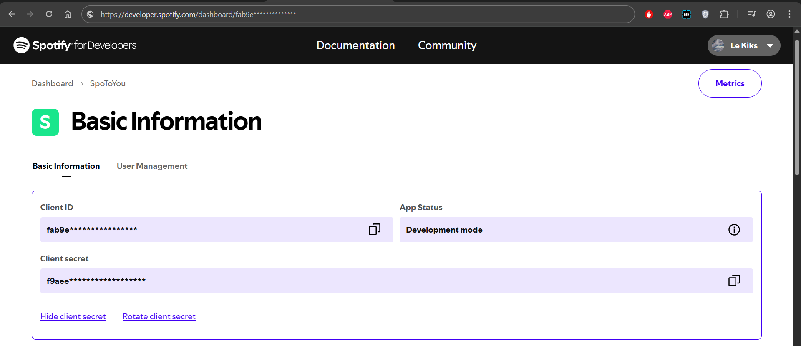
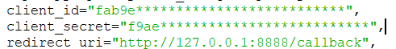
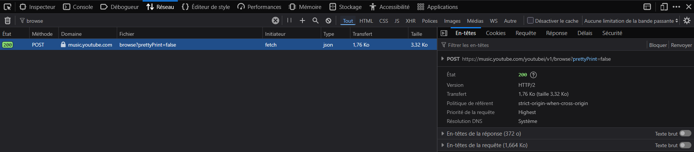

# SpoToYou

Transférez vos playlists Spotify vers YouTube Music. Ce script Python utilise spotipy et ytmusicapi pour automatiser le processus. Open source et facile à utiliser.
Taux de réussite des transfert de plus de 95%, certains sons peuvent ne pas être trouvés ou indisponibles (Strikes).

## ✨ Fonctionnalités

- Authentification à Spotify et YouTube Music
- Sélection de vos playlists Spotify
- Transfert automatique des morceaux vers une nouvelle playlist YouTube Music
- Affichage clair des morceaux trouvés / non trouvés

---

## 🔧 Prérequis

- Python 3.7 ou plus
- Un compte Spotify
- Un compte YouTube Music
- Une clé d'authentification `browser.json` pour YouTube Music (voir ci-dessous)

---

## 📦 Installation

1. Clonez le projet ou télécharger directement le fichier `.zip`

2. Installez les dépendances : pip install -r requirements.txt

3. Créez une appli sur `https://developer.spotify.com/`, et remplacez les clé d'identification aux lignes 135 et 136 du script :

4. Configurez browser.json (Pour se connecter à votre compte YT Music et créer une playlist)

## 🔐 Configuration de l'authentification YouTube Music (`browser.json`)

### 📋 Étapes :

1. **Ouvrez** un nouvel onglet dans **Firefox**. (Uniquement Firefox, c'est trop galère sur les autres moteurs).
2. **Allez sur** [https://music.youtube.com](https://music.youtube.com) et connectez-vous à votre compte Google/YouTube Music.
3. **Appuyez sur `Ctrl + Shift + I`** pour ouvrir les outils de développement.
4. Allez dans l’onglet **"Réseau"**.
5. **Filtrez** les requêtes réseau avec `browse` dans la barre de recherche. (Si vous n'en avez pas, cliquez sur Bibilothèque ou Explorer, une requête devrait apparaître).
Ça doit ressembler à ça : 
6. Cliquez sur **une requête POST** vers `browse` (statut `200`, domaine `music.youtube.com`).
7. **Faites un clic droit** sur la requête > `Copier la valeur` > `Copier les en-têtes de requête`.
8. Ouvrez un invite de commande (cmd) et tapez `ytmusicapi browser`, faites `Entrer` puis collez la requête copiée juste avant, ensuite faites `Entrer > Ctrl-Z > Entrer`
9. **Si vous avez une erreur, vérifiez que vous êtes bien connectés**, si rien ne se passe, regardez si le fichier a bien été crée et glissez le dans le dossier ou se trouve `SpoToYou.py`.

> ⚠️ **Ne partagez jamais votre fichier `browser.json` publiquement.** Il contient vos cookies d'authentification Google.

**Lancez maintenant** `SpoToYou.py` une page web se lance et vous demande de vous connecter à Spotify, si vous l'êtes déjà alors acceptez la demande de l'application pour accéder à vos playlists.
Voilà vous pouvez utiliser l'appli :) !
